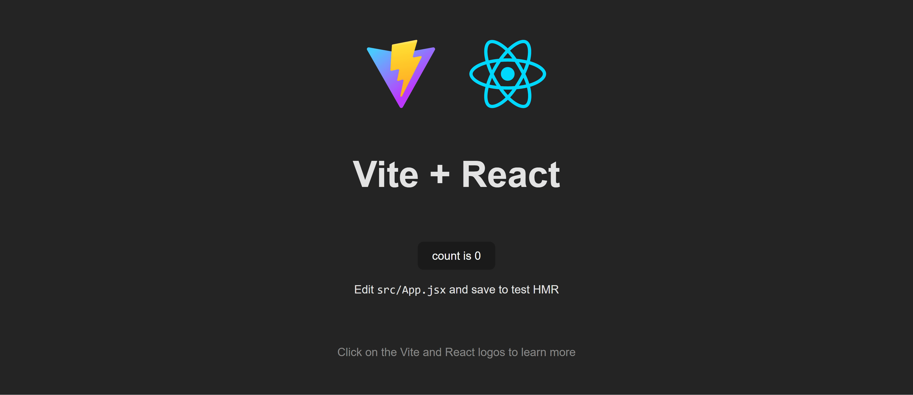

# React

### Conținut
1. [React 101](#1-react-101)
    1. [Componente - definire, state și props](#11-componente---definire-state-și-props)
    2. [Definirea unei componente](#12-definirea-unei-componente)
    3. [DOM-ul Virtual](#13-dom-ul-virtual)
    4. [Ciclul de viață al unei componente](#14-ciclul-de-via%C8%9B%C4%83-al-unei-componente)
    5. [Hooks](#15-hooks)

2. [Rescrierea interfeței grafice folosind React](#2-rescrierea-interfe%C8%9Bei-grafice-folosind-react)

3. [Lucru individual](#3-lucru-individual)
    1. [Editarea unei înregistrări](#31-editarea-unei-înregistrări)
    2. [Rescrierea paginilor Collection și Person](#32-rescrierea-paginilor-collection-și-person)

## 1. React 101
- **React** este o bibliotecă JavaScript [open-source](https://github.com/facebook/react) bazată pe componente și utilizată pentru eficientizarea procesului de construirea a interfețelor grafice

- React a fost dezvoltat, inițial, de _Facebook_ și publicat în anul _2013_

- La baza componentelor se află formatul **JSX** (_JavaScript XML_), ce permite descrierea structurii unei interfețe grafice prin tag-uri HTML integrate în cadrul fișierelor JavaScript, schimbând, astfel, într-o manieră sesizabilă, modul în care sunt dezvoltate aplicațiile front-end 

- Din acest motiv, spre diferență de utilizarea fișierelor JavaScript simple (denumite și Vanilla JavaScript), aplicațiile React trec printr-un pas adițional de compilare în urma căruia este obținut un singur fișier JavaScript principal ce conține toate componentele definite
    - Acest aspect este valabil pentru multe alte framework-uri JavaScript specializate în interfețe client (Angular, Vue, etc.)

- Unul dintre cele mai importante avantaje oferite de React este abilitatea de a dezvolta aplicațiile utilizând conceptul de _componente_

- [Recomandare: React în 100 de secunde](https://www.youtube.com/watch?v=Tn6-PIqc4UM)

### 1.1 Componente - definire, state și props
- O componentă React reprezintă un **fragment reutilizabil de cod** ce definește un element grafic individual izolat de celelalte părți ale aplicației

- Folosirea componentelor permite **modularizarea codului**, lucru care facilitează dezvoltarea, testarea și întreținerea aplicațiilor

- Prin definirea mai multor componente, dezvoltatorii pot realiza layout-uri distincte prin combinarea lor în moduri diverse și pot modifica subsecțiuni ale aplicației fără ca aceste modificări să afecteze alte zone
    

- Fiecare componentă este alcătuită din structura, _starea_ și logica sa corespunzătoare la care se adaugă, în unele cazuri, stilul specific importat din fișiere externe

- Pentru **gestionarea și transmiterea datelor între componente** sunt folosite 2 concepte fundamentale - **state** și **props**
    - **state-ul** definește _starea internă_ a unei componente
        - este _mutabil_
        
    - **prop-urile** sunt argumente primite de componentă din exterior
        - sunt _imutabile_

    

### 1.2 Definirea unei componente
- Definirea unei componente poate fi realizată în 2 moduri:
    - folosind clase - _Class-based components_ (modalitate _deprecated_ - nu mai este recomandată)
        - este extinsă clasa _Component_ din librăria React
        - clasa conține un constructor care primește prop-urile și inițializează state-ul componentei
        - fiecare componentă are o metodă _render_ în cadrul căreia este definit conținutul ce va fi afișat
        ```js
        import React, { Component } from 'react';

        class MyComponent extends Component {
            constructor(props) {
                super(props);
                this.state = {
                    // Starea componentei
                };
            }

            render() {
                // Logica de randare a componentei
            }
        }
        ```

    - folosind funcții - _Functional components_ (modalitate recomandată)
        - metoda _render_ din Class-based components este echivalentă în acest caz cu ceea ce returnează funcția
        - state-ul componentei este replicat utilizând hook-ul _useState_ (despre care vom discuta în secțiunile următoare)
        - **este necesară importarea contexului** din librăria React pentru ca fișierul să fie interpretat drept o componentă React și nu o funcție normală
        ```js
        function MyComponent(props) {
            // Logica de randare a componentei
        }
        ```

- Componentele definesc structura și logica unor subsecțiuni din interfața grafică, însă modul în care acestea sunt afișate și, ulterior, actualizate este strâns legat de un alt concept de bază al librăriei React: _DOM-ul Virtual_

### 1.3 DOM-ul Virtual
- **DOM-ul Virtual** (Virtual DOM) este o **reprezentare a interfeței grafice stocată în memorie sub forma unui arbore** și **sincronizată** cu DOM-ul "real" printr-un proces care poartă numele de **reconciliere** (_reconciliation_)
    

- În esență, mecanismul funcționează pe baza unui algoritm simplu:
    - o componentă React este afișată în pagină
    - un element din state-ul sau prop-urile sale se schimbă
    - pentru a reflecta noua stare, componenta este modificată în cadrul DOM-ului virtual
    - React compară DOM-ul virtual cu DOM-ul browserul care este, de fapt, starea anterioară a DOM-ului virtual, și actualizează _doar_ acele noduri care au fost modificate (reconciliere)

- Prin urmare, utilizarea DOM-ului virtual determină:
    - **Performanță îmbunătățită** 
        - Manipulările DOM sunt costisitoare, iar actualizarea întregului DOM (așa cum este cazul atunci când folosim Vanilla JavaScript) la fiecare schimbare poate duce la performanță scăzută
        - Folosirea unui DOM Virtual permite React să minimizeze și să optimizeze actualizările DOM-ului real

    - **Eficiență** 
        - React poate afișa eficient componentele și poate actualiza doar părțile necesare ale interfeței, fără a afecta alte părți ale aplicației

    - **Simplificarea manipulării elementelor structurale** 
        - Programatorii pot lucra cu un model declarativ, care se concentrează pe ceea ce trebuie afișat, în loc de a manipula în mod direct DOM-ul
            - Ne amintim seminarul anterior în care trebuia să creăm câte un element nou în JavaScript pe care, ulterior, să îl inserăm manual în DOM-ul paginii

- Pe parcursul utilizătii aplicației, ca urmare a actualizării datelor ce sunt afișate, o componentă trece prin mai multe reafișări ce fac parte din _ciclul de viață_ al unei componente

### 1.4 Ciclul de viață al unei componente
- **Ciclul de viață** al unei componente React descrie etapele prin care o componentă trece de la momentul creării până la momentul eliminării sale din cadrul DOM-ului

- Este un concept strâns legat de abordarea React bazată pe _clase_, prin existența unor așa-numite _lifecycle methods_ ce permit executarea unor acțiuni într-un anumit moment

- Principalele etape ale ciclului de viață din cadrul unei componente sunt:
    - **Mounting** (Montarea) 
        - componenta este creată și inserată în DOM

    - **Updating** (Actualizarea) 
        - state-ul sau prop-urile componentei se modifică

    - **Unmounting** (Demontarea)
        - componenta este eliminată din DOM

- Fiecare etapă are asociate anumite _lifecycle methods_ ce se execută în momentul în care componenta se află în acea etapă:
    

- În cadrul componentelor React funcționale, însă, ciclul de viață este simplificat, prin utilizarea unor hook-uri predefinite

### 1.5 Hooks
- **Hook-urile** sunt **funcții**, introduse o dată cu versiunea _16.8_ a React, care **permit**, printre altele, **replicarea caracteristicilor componentelor bazate pe clase** (_state, lifecycle methods_)
    

- Cele mai importante hooks pe care le vom folosi sunt _useState_ și _useEffect_
    - **useState**
        - permite componentelor funcționale să stocheze și să gestioneze o stare locală
        - se definește mereu prin tuplul _[numeVariabilă, setNumeVariabilă]_
        ```js
        import { useState } from 'react';

        function ExampleComponent() {
            // variabila count din state-ul componentei
            // valoarea variabilei se schimbă utilizând metoda setCount
            const [count, setCount] = useState(0);

            return (
                <div>
                    <p>You clicked {count} times</p>
                    <button onClick={() => setCount(count + 1)}>
                        Click me
                    </button>
                </div>
            );
        }
        ```

    - **useEffect**
        - permite efectuarea unor acțiuni în anumite momente din ciclul de viață al componentelor
        - primește **2 parametri**:
            - un callback
            - un array de dependențe (variabile - state sau props - care vor fi monitorizate, iar, în funcție de modificările lor va fi apelat callback-ul)
        ```js
            import React, { useState, useEffect } from 'react';

            function ExampleComponent() {
                const [data, setData] = useState(null);

                useEffect(() => {
                    // metodă care se execută după randare
                    fetchData();
      
                    // opțional
                    // callback-ul returnat din cadrul metodei useEffect va fi apelat atunci când componenta
                    //  va fi eliminată de pe ecran (unmounted), cât timp pasăm un array gol ca argument secund
                    return () => {
                        console.log("clean up the component");
                    }
                }, []); // array-ul de dependențe gol înseamnă că ceea ce este definit în callback se execută doar la montare

                useEffect(() => {
                    // metodă care se execută după randare, de fiecare dată când are loc un update
                    fetchData(); 
      
                    // opțional
                    // callback-ul returnat din cadrul metodei useEffect va fi apelat atunci când la nivelul
                    //  componentei are loc un update, înaintea re-randării
                    return () => {
                        console.log("clean up the component");
                    } 
                });
      
                useEffect(() => {
                    // metodă care se execută după randare, de fiecare dată când variabila data se modifică
                    fetchData();  
                }, [data]);
      
                const fetchData = async () => {
                    const result = await fetchDataFromAPI();
                    setData(result);
                };

            return (
                <div>
                // randare condițională în funcție de existența unei valori atribuite variabilei data
                    {data ? 
                        <p>Data loaded : {data}</p> 
                    : 
                        <p>Loading...</p>
                    }
                </div>
            );
        }
        ```

        - se disting 3 cazuri, în funcție de valorile ce pot fi utilizate pentru array-ul de dependențe
            - **array de dependențe gol** 
                - callback-ul se apelează _doar atunci când componenta este montată în DOM_
                - echivalent cu metoda ciclului de viață _componentDidMount_ din abordarea bazată pe clase

            - **array de dependențe cu valori**
                - callback-ul se apelează _la fiecare modificare a vreunei valori din array-ul de dependențe_
                - echivalent cu metoda _componentDidUpdate_ din abordarea bazată pe clase

            - **array de dependențe omis**
                - callback-ul se apelează _la fiecare re-render al componentei_

- React pune la dispoziția dezvoltatorilor multe hook-uri predefinite, precum și un mecanism de definire a [hook-urilor custom](https://react.dev/learn/reusing-logic-with-custom-hooks)

- În cadrul seminarului ne vom concentra pe hook-urile menționate mai sus, însă este recomandat să citești și despre alte hook-uri și, dacă este nevoie, să le folosești în cadrul proiectului
    - [Recomandare: Hook-uri (mai) complexe](https://medium.com/in-the-weeds/an-intro-to-advanced-react-hooks-a8af6397fe28)


## 2. Rescrierea interfeței grafice folosind React
### 2.1 Inițializarea React folosind Vite
- Pentru a putea folosi librăria React (și pentru că utilitarul _create-react-app_ [nu mai este de actualitate](https://dev.to/ag2byte/create-react-app-is-officially-dead-h7o)) vom crea un proiect schelet folosind _Vite_, un instrument modern pentru dezvoltarea de aplicații web
    - Trebuie menționat că, pentru a dezvolta o aplicație React, este nevoie de un mediu Node.js ce va gestiona procesele de build
    ```sh
    npm create vite@latest front-end-react -- --template react
    ```

- Ulterior directorul existent _front-end_ va fi șters, însă pentru moment, îl vom păstra pentru a putea transfera și transforma codul existent

- Utilitarul va crea o structură de directoare de bază pe care o vom actualiza ulterior și va adăuga configurări default pentru construirea aplicației (prezente în fișierele _vite.config.js_ și _eslint.config.js_)

- Apoi, conform cu instrucțiunile afișate în consolă, putem porni aplicația nou creată (după instalarea dependențelor)
    ```sh
    cd front-end-react
    npm install
    npm run dev
    ```

- Aplicația poate fi observată accesând adresa menționată în consolă: _http://localhost:5173_ (portul default este 5173)
    

- În ceea ce privește structura directoarelor, pot fi observate directoarele și fișierele principale:
    - directorul **public**
        - conține _fișiere statice_ care nu vor fi procesate, ci vor fi copiate în directorul de final la construirea proiectului
    - fișierul **index.html**
        - șablon de bază pentru pagina principală a aplicației tale React
        - aici poți modifica titlul, adăuga meta-informații sau include alte resurse statice
    - directorul **src**
      - conține _codul sursă al aplicației React_
    - directorul **src/assets**
       - conține _fișiere statice_ ce vor fi procesate împreună cu codul sursă
    - fișierul **src/main.jsx**
        - punctul de intrare în aplicația React
        - aici este importată și randată componenta principală `(<App />)` în elementul cu id-ul "root" din fișierul index.html
    - fișierul **src/index.css**
        - conține stilurile globale, utilizate la nivelul întregii aplicații
    - fișierul **src/App.jsx**
        - componenta principală a aplicației
    - fișierul **src/App.css**
        - stilul asociat componentei principale a aplicației
    - fișierul **package.json**
        - conține informații despre proiect, dependențele acestuia, scripturile de build și rulare, precum și alte configurări

- Similar cu structura directoarelor din aplicația back-end, vom structura componentele după tipul acestora

- Pentru început, definim două directoare principale - **pages** și **components**
    - pages va conține layout-ul unei pagini din aplicație
    - components va conține componente reutilizabile, integrate în una sau mai multe pagini
    ```
    src/
        ├── pages/
        |   └── Movies
        │       └── index.jsx
        │       └── style.css
        ├── components/
        │   └── MovieCard
        │       └── index.jsx
        │       └── style.css
        │   └── CreateMovieModal
        │       └── index.jsx
        │       └── style.css
        |   └── Searchbar
        │       └── index.jsx
        │       └── style.css
        └── ... // can contain services, util functions etc.
    ```

- Fiecare componentă va conține toata logica necesară pentru afișarea sa corectă și va fi compusă, pentru început, din două fișiere *index.js* și *style.css*

- Vom modifica conținutul fișierului _App.js_ pentru a afișa _pagina Movies.jsx_
    ```js
    import { Movies } from './pages/Movies';
    import './App.css';

    function App() {
        return (
            <div className="App">
                <div className="header">
                    <div className="app-title">action!</div>
                </div>
                <Movies />
            </div>
        );
    }

    export default App;
    ```

- Primul pas este să adăugam layout-ul paginii în care vom afișa filmele:
    - pages/Movies/index.jsx
    ```jsx
    import React, { useState, useEffect } from 'react';

    import { MovieCard } from '../../components/MovieCard';

    import './style.css';
    import { CreateMovieModal } from '../../components/CreateMovieModal';
    import { Searchbar } from '../../components/Searchbar';

    const SERVER_URL = "http://localhost:8080/api/v1";

    const Movies = () => {
        // declaram o variabila state pentru a stoca filmele - inițial este un array gol
        const [movies, setMovies] = useState([]);
        // declaram o variabila state pentru a determina daca afisam sau nu modala
        const [isModalOpen, setIsModalOpen] = useState(false);

        const getMovies = (queryTitle) => {
            const queryParams = new URLSearchParams();

            if (!!queryTitle) {
                queryParams.append("title", queryTitle);
            }

            // apelam metoda expusa de backend pentru a prelua filmele si le setam in state
            fetch(`${SERVER_URL}/movies?` + queryParams)
                .then(res => res.json())
                .then(data => setMovies(data.movies));
        };

        const addMovie = (movie) => {
            fetch(`${SERVER_URL}/movies`, {
                method: "POST",
                headers: {
                    'Content-Type': 'application/json',
                },
                body: JSON.stringify(movie)
            })
                .then(res => getMovies())
                .catch(err => console.log(err));
        }

        const deleteMovie = (movie) => {
            fetch(`${SERVER_URL}/movies/${movie.id}`, { method: "DELETE" })
                .then(res => getMovies())
                .catch(err => console.log(err));
        }

        useEffect(() => {
            // in momentul in care pagina este adaugata in DOM
            // se preiau datele din backend
            getMovies();
        }, []);

        const openModal = () => {
            setIsModalOpen(true);
        }

        const closeModal = () => {
            setIsModalOpen(false);
        }

        return (
            <div>
                <div className="container">
                    <h3>All movies</h3>
                    <Searchbar openModal={openModal} getMovies={getMovies} />
                    <div id="moviesContainer">
                        {/* sintaxa de JSX, pentru fiecare film din lista este afisata o componenta de tip MovieCard */}
                        {movies.map((movie, index) => (
                            <MovieCard movie={movie} key={index} onDelete={deleteMovie} />
                        ))}
                    </div>
                </div>
                {/* randare conditionala */}
                {isModalOpen && <CreateMovieModal onAddMovie={addMovie} closeModal={closeModal} />}
            </div>
        )
    };

    export { Movies };
    ```

- Ulterior, vom adăuga câte o componentă pentru fiecare secțiune importantă a paginii:
    - components/Searchbar/index.jsx
    ```jsx
    import React, { useState } from "react";

    import "./style.css";

    // primirea unor metode din parinte ce vor fi apelate din copil
    const Searchbar = ({ openModal, getMovies }) => {
        // declaram o variabila state pentru a stoca titlul filmului cautat de utilizator
        const [queryTitle, setQueryTitle] = useState(null);

        const onChangeQueryTitle = (event) => {
            // preluarea valorii introduse de utilizator pentru filmul cautat
            const searchedMovieTitle = event.target.value;
            // setarea valorii in state
            setQueryTitle(searchedMovieTitle);
        }

        return (
            <div className="toolbar">
                <input onChange={onChangeQueryTitle} id="search" className="searchbar custom-text-input" type="text" placeholder="Search for a movie" />
                <button className="custom-button" onClick={() => getMovies(queryTitle)}>Search</button>
                <button className="custom-button" onClick={() => openModal()}>Add a movie</button>
            </div>
        );
    };

    export { Searchbar };
    ```

    - components/MovieCard/index.jsx
    ```jsx
    import './style.css';

    // componenta MovieCard primeste un prop denumit movie - obiectul ce descrie un film
    // o functie onDelete ce va fi apelata atunci cand se doreste stergerea unui element
    const MovieCard = ({ movie, onDelete }) => {
        return (
            <div className="movie-container">
                
                <div className="movie-info-container">
                    <div className="movie-header">
                        <h4 className="movieTitle">
                            {/* sintaxa JSX */}
                            {`${movie.title} (${movie.year})`}
                        </h4>
                        {/* apeleaza la click functia de delete primita prin props si trimite filmul drept parametru */}
                        <button className="remove-btn" onClick={() => onDelete(movie)}>X</button>
                    </div>
                    <div className="movie-specs">
                        {`${movie.genre} • ${movie.duration} minutes • ${movie.director}`}
                    </div>
                    <div className="movie-synopsis">
                        {movie.synopsis}
                    </div>
                </div>
            </div>
        )
    };

    export { MovieCard };
    ```

    - components/CreateMovieModal/index.jsx
    ```jsx
    import { useState } from 'react';

    import "./style.css";

    const CreateMovieModal = ({ onAddMovie, closeModal }) => {
        // adaugam in state toate campurile care vor fi completate
        const [title, setTitle] = useState("");
        const [year, setYear] = useState(0);
        const [director, setDirector] = useState("");
        const [genre, setGenre] = useState("");
        const [synopsis, setSynopsis] = useState("");
        const [duration, setDuration] = useState(0);
        const [poster, setPoster] = useState("");

        // definim callbacks pentru evenimentele de onChange pentru toate inputurile
        const onChangeTitle = (event) => {
            setTitle(event.target.value);
        }

        const onChangeYear = (event) => {
            setYear(event.target.value);
        }

        const onChangeGenre = (event) => {
            setGenre(event.target.value);
        }

        const onChangeSynopsis = (event) => {
            setSynopsis(event.target.value);
        }

        const onChangeDirector = (event) => {
            setDirector(event.target.value);
        }

        const onChangeDuration = (event) => {
            setDuration(event.target.value);
        }

        const onChangePoster = (event) => {
            setPoster(event.target.value);
        }

        const saveMovie = (event) => {
            // impiedicam trimiterea default a formularului -> refresh paginii
            event.preventDefault();
            // pasam functiei de salvare obiectul movie construit prin completarea formularului
            onAddMovie({ title, year, director, genre, synopsis, duration, poster });
            closeModal();
        }

        return (
            <dialog id="CreateMovieModal" className="modal">
                <div className="modal-content">
                    <div className="modal-header">
                        <h2>Add movie</h2>
                        <span className="modal-close" onClick={closeModal}>&times;</span>
                    </div>
                    <form id="addMovieForm" className="create-form">
                        <label htmlFor="title">Title:</label>
                        <input onChange={onChangeTitle} className="custom-text-input" type="text" id="title" name="title" required /><br />

                        <label htmlFor="year">Year:</label>
                        <input onChange={onChangeYear} className="custom-text-input" type="number" id="year" name="year" required /><br />

                        <label htmlFor="director">Director:</label>
                        <input onChange={onChangeDirector} className="custom-text-input" type="text" id="director" name="director" required /><br />

                        <label htmlFor="genre">Genre:</label>
                        <input onChange={onChangeGenre} className="custom-text-input" type="text" id="genre" name="genre" required /><br />

                        <label htmlFor="synopsis">Synopsis:</label>
                        <textarea onChange={onChangeSynopsis} className="custom-text-input" id="synopsis" name="synopsis" required></textarea><br />

                        <label htmlFor="duration">Duration (minutes):</label>
                        <input onChange={onChangeDuration} className="custom-text-input" type="number" id="duration" name="duration" required /><br />

                        <label htmlFor="poster">Poster URL:</label>
                        <input onChange={onChangePoster} className="custom-text-input" type="url" id="poster" name="poster" required /><br />

                        <button className="custom-button" onClick={saveMovie}>Save</button>
                    </form>
                </div>
            </dialog>
        )
    };

    export { CreateMovieModal };
    ```

- Apoi, utilizând stilurile definite în cadrul seminarului trecut, vom muta anumite definiții de stiluri în componentele în care trebuie aplicate:
    - index.css (stiluri globale)
    ```css
    /* configurarea elementului body */
    body {
        /* pentru ca elementul dialog este pozitionat, in mod default ca absolute, trebuie sa pozitionam si parintele pentru a putea pozitiona modala fata de body */
        position: relative;
        /* eliminarea marginilor si a padding-ului default */
        margin: 0;
        padding: 0;
        /* aplicarea unei culori de fundal */
        /* utilizarea unei culori folosind formatul hex */
        background-color: #CEEAF7;
        /* inaltimea body-ului trebuie sa acopere intreaga pagina, pentru a permite modalei, pozitionata absolut fata de body, sa ocupe, la randul ei, intreaga inaltime a paginii */
    }

    .custom-text-input {
        padding: 5px 10px;
        border-radius: 20px;
        border: 1px solid black;
    }

    .custom-button {
        padding: 5px;
        border-radius: 20px;
        font-weight: bold;
        background-color: #FFB17A;
        /* afisarea si stilizarea umbrei unui element */
        box-shadow: 0px 4px 4px 0px rgba(0, 0, 0, 0.25);
        border: 1px solid black;
        cursor: pointer;
    }

    .remove-btn {
        height: 40px;
        padding: 3px 10px;
        border-radius: 20px;
        font-weight: bold;
        background-color: #B31515;
        box-shadow: 0px 4px 4px 0px rgba(0, 0, 0, 0.25);
        border: 1px solid black;
        /* stilizarea cursorului */
        cursor: pointer;
        /* stilizarea culorii fontului */
        color: white;
    }
    ```

    - App.css (stiluri pentru componenta principală)
    ```css
    .header {
        background-color: #201335;
        height: 60px;
        color: white;
        /* utilizarea unui container flex ce asigura redimensionarea automata a header-ului */
        display: flex;
        align-items: center;
        /* stilizarea padding-ului din partea stanga a elementului */
        padding-left: 20px;
    }

    .app-title {
        /* stilizarea dimensiunii si a stilului fontului utilizat */
        font-weight: bold;
        font-size: 16px;
    }
    ```

    - pages/Movies/style.css
    ```css
    .movie-container {
        /* stilizarea bordurii unui element */
        border: 1px solid black;
        padding: 10px;
        margin: 10px auto;
        background-color: white;
        border-radius: 20px;
        display: flex;
    }

    .movie-info-container {
        padding: 20px;
        display: flex;
        /* ordonarea pe verticala a elementelor dintr-un flexbox */
        flex-direction: column;
        gap: 10px;
        width: 100%;
    }

    .movie-header {
        display: flex;
        gap: 10px;
    }

    /* utilizarea pseudo-clasei first-child ce va selecta, asa cum ii spun enumele, primul copil al elementului curent */
    .movie-header :first-child {
        flex: 1;
    }

    .movie-specs {
        font-style: italic;
    }

    .movie-synopsis {
        padding: 20px;
        border: 1px solid black;
        background-color: #FFB17A;
        /* rotunjirea marginilor bordurii unui element */
        border-radius: 20px;
    }

    .poster-container {
        /* setarea inaltimii maxime pe care un element o poate avea */
        max-height: 200px;
    }

    .edit-movie-form {
        margin: 20px 0;
        display: flex;
        flex-direction: column;
        width: 100%;
    }

    .movie-tool-btn {
        height: 40px;
    }
    ```

    - components/Searchbar/style.css
    ```css
    .toolbar {
        margin: 20px 0;
        display: flex;
        /* spatierea dintre elementele unui flexbox */
        gap: 10px;
    }

    /* elementele cu clasa searchbar vor ocupa tot spatiul ramas in cadrul unui container flex dupa ce elementele alaturate vor fi afisate */
    .searchbar {
        flex: 1;
    }
    ```

    - components/MovieCard/style.css
    ```css
    .movie-container {
        /* stilizarea bordurii unui element */
        border: 1px solid black;
        padding: 10px;
        margin: 10px auto;
        background-color: white;
        border-radius: 20px;
        display: flex;
    }

    .movie-info-container {
        padding: 20px;
        display: flex;
        /* ordonarea pe verticala a elementelor dintr-un flexbox */
        flex-direction: column;
        gap: 10px;
        width: 100%;
    }

    .movie-header {
        display: flex;
        gap: 10px;
    }

    /* utilizarea pseudo-clasei first-child ce va selecta, asa cum ii spun enumele, primul copil al elementului curent */
    .movie-header :first-child {
        flex: 1;
    }

    .movie-specs {
        font-style: italic;
    }

    .movie-synopsis {
        padding: 20px;
        border: 1px solid black;
        background-color: #FFB17A;
        /* rotunjirea marginilor bordurii unui element */
        border-radius: 20px;
    }

    .poster-container {
        /* setarea inaltimii maxime pe care un element o poate avea */
        max-height: 200px;
    }

    .edit-movie-form {
        margin: 20px 0;
        display: flex;
        flex-direction: column;
        width: 100%;
    }

    .movie-tool-btn {
        height: 40px;
    }
    ```

    - components/CreateMovieModal/style.css
    ```css
    /* Stilizarea modalei */
    .modal {
        /* pozitionarea implicita modalei este absoluta, deci poate fi plasa la inceputul parintelui */
        top: 0;
        /* acoperirea intregului spatiu disponibil din parinte */
        width: 100%;
        height: 100%;
        padding: 0;
        border: 0px;
        /* utlizarea unei culori de fundal, impreuna cu un coeficient de transparenta */
        background-color: rgba(0, 0, 0, 0.4);
        /* pozitionarea elementului absolut la inceputul paginii */
        display: block;
    }

    .modal-content {
        background-color: #fff;
        margin: 15% auto;
        padding: 20px;
        border: 1px solid #000;
        border-radius: 20px;
        width: 50%;
    }

    .modal-header {
        display: flex;
    }

    .modal-header h2 {
        flex: 1;
    }

    .modal-close {
        cursor: pointer;
    }

    .create-form {
        margin: 20px 0;
        display: flex;
        flex-direction: column;
    }
    ```

## 3. Lucru individual
### 3.1 Editarea unei înregistrări
- Pe lângă posibilitatea de a adăuga, șterge și căuta filme, o aplicație reală ar trebui sa permită utilizatorului să modifice înregistrările deja inserate

- Folosind toate conceptele despre care am discutat până acum, încearcă să implementezi funcționalitatea de editare a unui film afișat în listă

- Modul în care integrezi această funcționalitate în interfața grafică deja existentă este alegerea ta
    - Poți opta pentru o fereastră modală sau pentru editare in-place - nu există nicio restricție

### 3.2 Rescrierea paginilor Collection și Person
- Ulterior, pentru a exersa dezvoltarea componentelor React, încearcă să rescrii celelalte pagini, asociate cu entitățile Collection și Person
