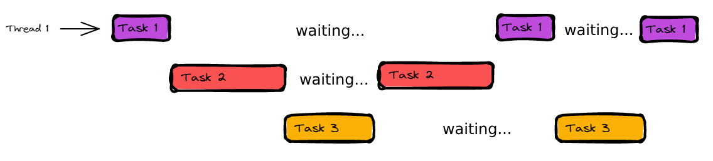

# Programare asincronă: callback, Promise, async/await

## Conținut
1. [Programarea sincronă și programarea asincronă](#1-programarea-sincronă-și-programarea-asincronă)
    1. [Programarea sincronă](#11-programarea-sincronă)
    2. [Programarea asincronă](#12-programarea-asincronă)

2. [Callbacks](#2-callbacks)
    1. [Callback hell](#21-callback-hell)

3. [Promises](#3-promises)
    1. [Crearea unui promise](#31-crearea-unui-promise)
    2. [Stările unui promise](#32-stările-unui-promise)
    3. [Înlănțuirea](#33-înlănțuirea)
    4. [Gestionarea erorilor](#34-gestionarea-erorilor)
    5. [Metodele clasei Promise](#35-metodele-clasei-promise)

4. [async/await](#4-asyncawait)

5. [Exemple](#5-exemple)

6. [Exerciții](#6-exerciții)


## 1. Programarea sincronă și programarea asincronă
- Programarea sincronă și programarea asincronă sunt două paradigme diferite de gestionare a fluxului de execuție ale instrucțiunilor

- În ciuda faptului că descriu două paradigme diferite, majoritatea limbajelor moderne dispun de mecanisme ce implementează ambele stiluri de programare, fiecare având avantaje și dezavantaje

### 1.1 Programarea sincronă
- Programarea sincronă reprezintă stilul de programare implicit pentru majoritatea limbajelor de programare, inclusiv pentru JavaScript, în care instrucțiunile unui program sunt executate secvențial

- Spunem despre programarea sincronă că este blocantă deoarece o singură instrucțiune este executată la un moment dat, instrucțiunea imediat următoare va aștepta finalizarea acesteia înainte de a putea fi executată la rândul său (determinând aceeași *așteptare* pentru instrucțiunea următoare și așa mai departe)

    

- Principalul avantaj este reprezentat de simplitatea rezultată, codul sincron fiind executat *top-to-bottom*, într-un mod ușor de parcurs
    ```javascript
    function simpleFunction(x, y) {
        const z = x + y;
        console.log(z);
    }

    function secondFunction() {
        console.log("Hello, Web!");
    }

    // instrucțiunile sunt executate în ordinea definirii (și, implicit, a apelurilor)
    console.log("Hello");
    simpleFunction();
    secondFunction();
    ```

- Principalul dezavantaj îl reprezintă însă caracterul blocant, ce nu permite unui program să execute mai multe instrucțiuni atunci când o instrucțiune complexă, ce durează mult timp, se află în executare
    ```javascript
    function performHeavyOperation() {
        let x = 0;
        for (let i = 0; i < 10000000000; i++) {
            x += i;
        }
    }

    console.log("Starting something heavy")
    performHeavyOperation();
    console.log("This will take a while..."");
    ```

- Acest dezavantaj este cu atât mai relevant în contextul JavaScript, care a fost creat pentru a integra elemente dinamice în paginile web
    - Dacă rulăm exemplul anterior în browser, vom observa că, pe toată durata de execuție a metodei *performHeavyOperation*, pagina nu mai răspunde evenimentelor generate, deoarece JavaScript, un limbaj single-threaded la bază, va executa instrucțiunile în ordinea în care aceasta au fost invocate

- Pentru un limbaj single-threaded precum JavaScript, blocarea thread-ului principal nu poate fi evitată în momentul în care o instrucțiune intensivă se află în execuție, însă, în general, în aplicațiile interactive, operațiunile intesive sunt evitate, fiind înlocuite, în schimb, cu operațiuni de intrare/ieșire (I/O) care, în regim sincron, produc același efect de blocare

- Din acest motiv, JavaScript oferă suport nativ pentru multiple tehnici de *programare asincronă*

### 1.2 Programarea asincronă
- Programarea asincronă este un stil de avansat de programare ce permite unui runtime să execute mai multe instrucțiuni la un moment dat, fără să aștepte finalizarea unor instrucțiuni anterioare

    

- În JavaScript, majoritatea operațiunilor asincrone au la bază evenimente de intrare/ieșire, atât pe back-end, cât și pe front-end
    - apelarea unui serviciu extern
    - executarea unui query în baza de date
    - gestionarea evenimentelor declanșate de interacțiunea unui utilizator cu o pagină web
    - încărcarea sau descărcarea unui fișier

- Programarea asincronă utilizează evenimentele ca principal mecanism de notificare, permițând unor instrucțiuni să fie executate abia în momentul în care o operațiune de lungă durată a fost finalizată, fără ca thread-ul principal să fi așteptat în mod activ finalizarea acesteia

    

- Una dintre cele mai clare exemplificări ale diferențelor dintre programarea sincronă și programarea asincronă este [exemplul bucătarului](https://www.youtube.com/shorts/v6sI1tidSw8)

- Principalele avantaje ale programării asincrone sunt creșterea gradului de responsivitate, reducerea timpilor de așteptare, și o mai bună gestionare a resurselor, JavaScript fiind un limbaj extrem de rapid în context I/O, în ciuda faptului că utilizează un singur thread

- Principalul dezavantaj este reprezentat de complexitatea suplimentară adăugată, codul nemaiavând un flux de execuție secvențial
    ```javascript
    console.log("Start of script");

    setTimeout(() => {
        console.log("First timeout completed");
    }, 1000);

    console.log("End of script");
    ```

- În exemplul anterior, apelarea metodei *setTimeout* simulează executarea în mod asincron a unei operațiuni de lungă durată, cum ar fi apelarea unui serviciu web sau descărcarea unei imagini
    - Observăm că fluxul programului nu este linear, fapt ce, într-un context cu multe instrucțiuni și structuri de date, crește considerabil complexitatea codului

- Pentru a gestiona asincron toate evenimentele generate pe parcursul execuției unui program, JavaScript folosește un [event loop](https://i.ibb.co/nbQc6sk/Javascript-event-loop.png) ce stă la baza întregului runtime
    - [recomandare pentru a înțelege la un nivel aprofundat modul în care JavaScript execută instrucțiunile asincrone](https://www.youtube.com/watch?v=8aGhZQkoFbQ) 

- În termeni simpli, putem spune că, în momentul în care interacționează cu un agent extern, JavaScript va pune la dispoziția acestuia o metodă de a notifica finalizarea operațiunii executate, evitând astfel monitorizarea activă a progresului (fără să aștepte), fapt ce permite thread-ului principal să execute alte instrucțiuni

    

- Folosind acest mecanism, JavaScript, și, prin extensie, sistemele ce folosesc tehnici de programare asincronă, pot ajunge să depașească performanța sistemelor tradiționale, în special în contexte intensive I/O
    

- Acest mecanism de executare a unei grupări de instrucțiuni într-un moment viitor nedefinit, la finalizarea unei operațiuni de durată, a fost implementat inițial în JavaScript cu ajutorul **callback-urilor** 


## 2. Callbacks
- Un callback este o funcție pasată ca parametru către o altă funcție, cu scopul de a fi executată la un moment dat în interiorul acelei funcții

- Am întâlnit pentru prima dată conceptul de callback atunci când am discutat despre metodele specifice [array-urilor](../s3/README.md#15-parcurgerea-unui-array)
    ```javascript
    const arr = [
        {name: "john", age: 18},
        {name: "jim", age: 16},
        {name: "little george", age: 8},
        {name: "matthew", age: 21}
    ];

    // metoda filter primește ca parametru un callback
    const filteredArray = arr.filter(element => element.age >= 18);
    console.log(filteredArray);
    ```

- În contextul programării asincrone, un callback poate fi utilizat astfel:
    ```javascript
    function fetchData(callback) {
        setTimeout(() => {
            const data = {name: "John", age: 18};
            callback(data);
        }, 2000);
    }

    // callback-ul va fi apelat atunci când metoda non-blocking se va finaliza
    fetchData(function(data) {
        console.log("Data was fetched!");
        console.log(data);
    });

    console.log("Data is being fetched...");
    ```

### 2.1 Callback hell
- Callback-urile sunt o funcționalitate foarte puternică și foarte utilă, reprezentând primul mecanism de gestionare a asincronicității în JavaScript

- Totuși, într-o aplicație reală, interactivă, ce utilizează un număr mare de operații asincrone, utilizarea callback-urilor poate să afecteze lizibilitatea codului sursă
    ```javascript
    function doStep1(init, callback) {
        const result = init + 1;
        callback(result);
    }

    function doStep2(init, callback) {
        const result = init + 2;
        callback(result);
    }

    function doStep3(init, callback) {
        const result = init + 3;
        callback(result);
    }

    function doOperation() {
        doStep1(0, (result1) => {
            doStep2(result1, (result2) => {
                doStep3(result2, (result3) => {
                    console.log(`result: ${result3}`);
                });
            });
        });
    }

    doOperation();
    ```

- În exemplul anterior, în ciuda faptului că am folosit doar 3 callback-uri, codul devine greu de citit, fiind dificil de determinat modul în care metodele se apelează progresiv 

- Această situație poartă denumirea de *callback hell* și poate conduce la introducerea de bug-uri foarte greu de depistat, motiv pentru care utilizarea excesivă a callback-urilor nu este recomandată 
    - [exemplu extrem de callback hell](./examples/callback-hell.js)

- Pentru a rezolva această problemă, în 2015, a fost introdus un model nou, fundamental pentru gestionarea a operațiunilor asincrone în aplicațiile moderne: **Promise-ul**


# 3. Promises
- Un promise reprezintă un obiect care, într-un moment nedeterminat din viitor, va conține rezultatul pozitiv sau negativ al unei operațiuni asincrone

- Similar unui callback, ce este apelat la finalul unei acțiuni asincrone, valoarea unui promise nu este cunoscută în momentul definirii, ci va fi determinată, la un moment dat, în urma finalizării unei operații asincrone

### 3.1 Crearea unui promise
- Un promise poate fi creat folosind constructorul specific
    ```javascript
    const promise = new Promise((resolve, reject) => {
        // implementarea unui Promise
        const rnd = Math.random() * 10;

        if(rnd % 2 === 0) {
            resolve(rnd);
        } else {
            reject(rnd);
        }
    });
    ```

- Constructorul obiectului de tip Promise va primi ca parametru o funcție, denumită funcție executor, ce va avea, întotdeauna, doi parametri:
    - resolve - o metodă predefinită ce trebuie apelată atunci când operațiunea din cadrul promise-ului este finalizată cu succes
    - reject - o metodă predefinită ce trebuie apelată atunci când apare o eroare ce face imposibilă finalizarea operațiunii executate 

### 3.2 Stările unui promise
- Deoarece este un obiect utilizat pentru modelarea operațiilor asincrone, rezultatul unui promise nu este cunoscut în momentul definirii, acesta aflându-se, la un moment dat, în una dintre cele trei stări posibile:
    - pending - starea inițială, rezultatul promise-ului nu a fost încă determinat
    - fulfilled - stare finală, operațiunea s-a încheiat cu succes
    - rejected - stare finală, operațiunea a eșuat

- Considerăm că un promise a fost finalizat (*settled*) în momentul în care a ajuns în una dintre cele două stări finale: fulfilled sau rejected

- Pe lângă *state*, un promise conține o proprietate suplimentară ce stochează rezultatul concret al operațiunii executate:
    - în pending - un rezultat generic de tipul undefined
    - în fulfilled - un obiect ce conține valoarea returnată de promise
    - în rejected - un obiect de tip eroare

- Pentru a gestiona comportamentul programului în momentul în care un promise este finalizat, putem folosi metodele *then*, *catch* și *finally*
    ```javascript
    promise
        .then((result) => {
            // va fi executat atunci când promise-ul va fi resolved
            console.log(result);
        })
        .catch((error) => {
            // va fi executat atunci când promise-ul va fi rejected
            console.log(error);
        })
        .finally(() => {
            // opțional metoda finally ce funcționează identic ca în mecanismul try/catch/finally
        })
    ```

### 3.3 Înlănțuirea
- Metodele *then*, *catch* și *finally* vor împacheta orice rezultat returnat ce nu este un promise într-un nou promise, permițând astfel înlănțuirea mai multor promise-uri

- Prin înlănțuirea secvențială se evită situațiile similare celor care ar conduce la callback hell

    

```javascript
    // simularea preluării datelor de pe un server remote
    function fetchData() {
        return new Promise((resolve, reject) => {
            setTimeout(() => {
                const data = Math.random();
                resolve(data);
                }, 1000);
        });
    }

    // înlănțuirea mai multor promise-uri
    fetchData()
        .then((data) => {
            console.log("Step 1: Data fetched:", data);
            // rezultatul va fi automat împachetat într-un Promise
            return data * 2; // procesarea datelor
        })
        .then((processedData) => {
            console.log("Step 2: Data processed:", processedData);
            return processedData + 3; // procesare suplimentară
        })
        .then((finalResult) => {
            console.log("Step 3: Final result:", finalResult);
        })
        .catch((error) => {
            console.error("Error:", error);
        });
```

### 3.4 Gestionarea erorilor
- Atunci când un promise din cadrul unei înlănțuiri va fi respins, blocul catch va fi utilizat indiferent de numărul de blocuri then definite anterior

    ```javascript
    // simularea unei funcții care respinge un promise
    function simulateError() {
        return new Promise((resolve, reject) => {
            setTimeout(() => {
                reject("Something went wrong");
            }, 1000);
        });
    }

    // utilizarea metodei catch
    simulateError()
        .then((result) => {
            console.log("This will not be executed");
        })
        .then((result) => {
            console.log("This will not be executed");
        })
        .then((result) => {
            console.log("This will not be executed");
        })
        .catch((error) => {
            console.error("This will be printed:", error); 
        });
    ``` 

- Similar, dacă vreo eroare este aruncată în interiorul unui promise, aceasta va fi împachetată automat într-un alt promise ce va fi rejected și va fi gestionat de către blocul catch
    ```javascript
    function fetchData() {
        return new Promise((resolve, reject) => {
            setTimeout(() => {
                accept("The promise finished");
            }, 1000);
        });
    }

    // utilizarea metodei catch
    fetchData()
        .then((result) => {
            console.log(result);
            console.log("This will be executed");
        })
        .then((result) => {
            throw new Error("Something bad happened");
        })
        .then((result) => {
            console.log("This will not be executed");
        })
        .catch((error) => {
            console.error("This will be printed:", error); 
        });
    ``` 

### 3.5 Metodele clasei Promise
- La fel ca în cazul clasei Array, clasa Promise expune o serie de metode statice ce extind funcționalitățile de bază

- **Promise.resolve() și Promise.reject()**
    - două metode similare ce permit crearea automată a unui promise *settled*, fără a utiliza constructorul clasei
        ```javascript
        const resolvedPromise = Promise.resolve("Finishes with success");
                
        resolvedPromise
            .then(result => console.log(result));


        const rejectedPromise = Promise.reject("Didn't work this time");
        rejectedPromise
            .then(result => console.log(result))
            .catch(error => console.log("Error: " + error));
        ```

- **Promise.all()**
    - Realizează împachetarea mai multor promise-uri într-un nou promise ce va fi rezolvat în momentul în care toate promise-urile primite ca parametru sunt rezolvate
    - Dacă cel puțin unul dintre promise-urile primite ca parametru este respins, întregul promise generat va fi respins cu acea eroare
    - Este o metodă utilă pentru agregarea și sincronizarea mai multor promise-uri
        ```javascript
        // agregarea datelor provenit din surse diferite
        function fetchArticleTitle(url) {
            // se observă utilizarea metodei fetch ce permite apelarea unor servicii web și interpretarea răspunsurilor primite 
            // pentru un exemplu detaliat, consultă fișierul fetch.js din directorul examples
            return fetch(url)
                .then((response) => response.json())
                .then((data) => data.title);
        }

        const urls = [
            "https://jsonplaceholder.typicode.com/posts/1",
            "https://jsonplaceholder.typicode.com/posts/2",
            "https://jsonplaceholder.typicode.com/posts/3"
        ];

        const requests = urls.map((url) => fetchArticleTitle(url));

        Promise.all(requests)
        .then((titles) => {
            console.log("Article Titles:", titles);
        })
        .catch((error) => {
            console.error("An error occurred:", error);
        });
        ```

- **Promise.allSettled()**
    - La fel ca Promise.all(), împachetează un array de promise-uri primite ca parametru
    - Spre diferență de aceasta, Promise.allSettled va returna întotdeauna un promise rezolvat în momentul în care toate promise-urile primite ca parametru devin settled (indiferent că sunt rezolvate sau respinse)
    - Conținutul promise-ului rezolvat este reprezentat de un array de promise-uri settled ce păstrează ordinea specificată în cadrul input-ului
        ```javascript
        const promise1 = Promise.resolve(3);
        const promise2 = new Promise((resolve, reject) => setTimeout(reject, 2000, 'foo'));
        const promises = [promise1, promise2];

        Promise.allSettled(promises).then((results) => results.forEach((result) => console.log(result.status)));
        ``` 

- Clasa Promise include două metode suplimentare mai puțin utilizate: *race* și *any*, despre care poți citi mai multe [aici](https://javascript.plainenglish.io/promise-in-javascript-with-all-the-methods-b7357196a57e)

- Deși reprezintă o îmbunătățire considerabilă față de utilizarea callback-urilor, promise-urile continuă să adauge un nivel suplimentar de complexitate codului, fiecare operațiune asincronă având nevoie de instrucțiuni suplimentare specifice pentru a fi gestionată

- Din acest motiv, în anul 2017, în JavaScript sunt introduși termenii *async* și *await*


## 4. async/await
- Perechea de keyword-uri async/await oferă programatorilor un mod de a scrie cod asincron într-un format care să nu se îndepărteze foarte mult de modul de scriere a codului sincron

- La fel cum promise-urile sunt construite pe bazele oferite de către callback-uri, async/await are la promise-uri și sunt utilizate împreună cu acestea
    - Pe lângă Promise-uri, async/await utilizează și conceptul de functii *generator*, despre care poți citi mai multe [aici](https://developer.mozilla.org/en-US/docs/Web/JavaScript/Reference/Global_Objects/Generator)

- Spre diferență de promise-uri, însă, acestea sunt mai ușor de folosit, crescând foarte mult lizibilitatea codului
    ```javascript
    // operațiune asincronă de lungă durată
    function delay(ms) {
        return new Promise((resolve) => {
            setTimeout(resolve, ms);
        });
    }

    // metodă asincronă, remarcăm keyword-ul async
    async function exampleAsyncFunction() {
        console.log("Start");

        // folosind keyword-ul await, se va aștepta finalizarea 
        //  executării metodei asincrone înainte de a trece mai departe
        await delay(2000);

        // linie de cod ce va fi executată similar cu modelul sincron
        console.log("After 2 seconds");
    }

    exampleAsyncFunction();
    ```

- Termenul *async* marchează o metodă ca fiind asincronă, orice rezultat returnat de această metodă va fi împachetat într-un promise
    ```javascript
    async function fetchUserDetails() {
        // simulează un apel către un server remote
        // returnează info despre user
        return {'name': 'Michael', 'likes': ['movies', 'teaching']};
    }
    ```

- Termenul *await* va suspenda executarea metodei curente până în momentul în care promise-ul returnat va fi finalizat
    ```javascript
    async function displayUserDetails() {
        const user = await fetchUserDetails();

        // instrucțiune executată după finalizarea promise-ului returnat de metoda fetchUserDetails
        console.log(user);
    }
    ```

    - Din acest punct de vedere keyword-ul async înlocuiește utilizarea metodei *then*, tot codul definit după utilizarea lui fiind executat după finalizarea promise-ului

- Gestionarea erorilor în contextul utilizării try/catch este similar cu gestionarea erorilor în context sincron, lucru ce reduce complexitatea codului
    ```javascript
    async function displayUserDetails() {
        try {
            const user = await fetchUserDetails();
            // utilizarea datelor returnate
        } catch (error) {
            // gestiune erori
        }
    }
    ```


## 5. Exemple
- 1. [Utilizarea callback-urilor](./examples/callback.js)
- 2. [Callback hell](./examples/callback-hell.js)
- 3. [Utilizarea unui promise](./examples/promise.js)
- 4. [Utilizarea async/await](./examples/async-await.js)
- 5. [Utilizarea metodei fetch folosind un promise](./examples/fetch-promise.js)
- 5. [Utilizarea metodei fetch folosind async/await](./examples/fetch-async-await.js)


## 6. Exerciții
- 1. [Utilizarea callback-urilor](./practice/callback.js)
- 2. [Utilizarea unui promise](./practice/promise.js)
- 3. [Utilizarea async/await](./practice/async-await.js)
