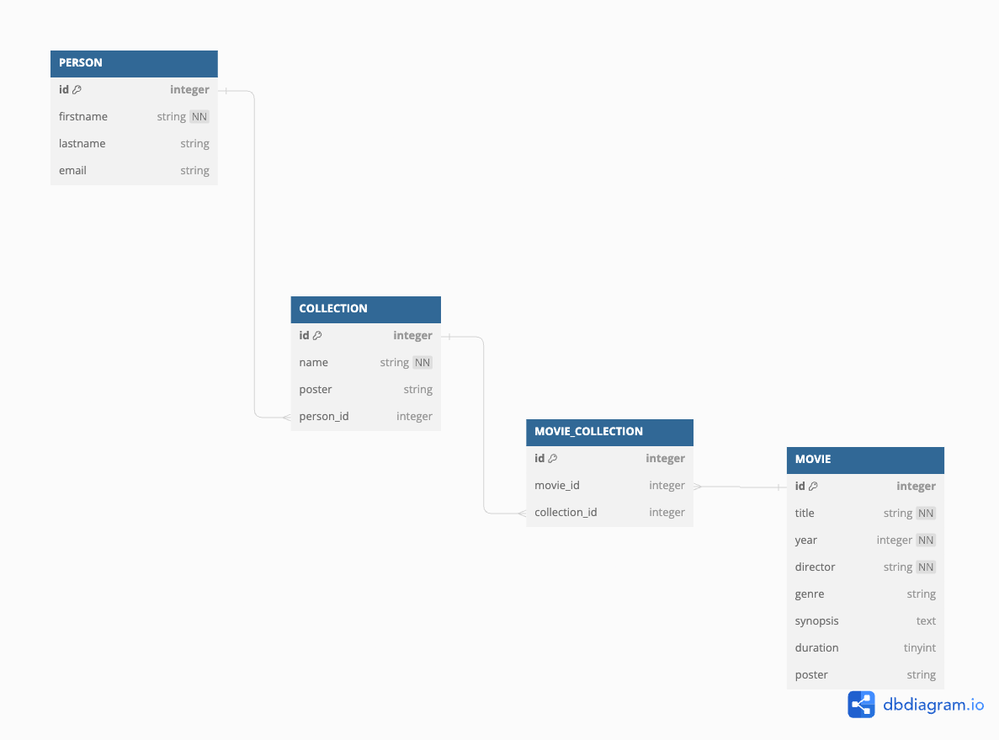

# Relațiile între entități și recapitulare back-end 

## Conținut
1. [Lucru individual](#1-lucru-individual)

2. [Relațiile între entități](#2-relațiile-între-entități)
    1. [One-to-One](#21-one-to-one)
    2. [One-to-Many / Many-to-One](#22-one-to-many--many-to-one)
    3. [Many-to-Many](#23-many-to-many)
    4. [Accesarea entităților asociate](#24-accesarea-entităților-asociate)

3. [Relația dintre entitățile Movie și Collection](#3-relația-dintre-entitățile-movie-și-collection)
    1. [Structura bazei de date](#31-structura-bazei-de-date)
    2. [Implementarea relației](#32-implementarea-relației)

4. [Recapitulare back-end](#4-recapitulare-back-end)

5. [Lucru individual 2](#5-lucru-individual-2)

6. [Resurse utile](#6-resurse-utile)


## 1. Lucru individual
- Așa cum am amintit în seminarul anterior, aplicația pe care o vom dezvolta împreună, denumită *action!*, ne va permite să gestionăm mai multe liste de filme pe care dorim să le vizionăm împreună cu alți prieteni

- Pe lângă entitatea *Movie*, pe care deja am implementat-o, este nevoie să implementăm două entități adiționale:
    - Collection
    - Person

- În continuare vom adăuga entitatea Collection și toate componentele necesare pentru implementarea unor endpoint-uri RESTful plecând de la această entitate

- Pași ajutători:
    - descarcă aplicația în [versiunea curentă](https://github.com/axbg/webtech-24/releases/tag/app-after-lab-7)

    - instalează modulele necesare
        - fișierul package.json, care enumeră modulele necesare, este deja definit, e necesar doar să rulezi o comandă :) 
    
    - definirea entității după structura:
        - id: integer, cheie primară, autoincrementare
        - name: string, nenul
        - poster: string
    
    - importarea entității în baza de date folosind fișierul de configurare a bazei de date

    - definirea unui serviciu care să folosească entitatea și să implementeze operațiile CRUD
        - create
        - read
        - update
        - delete

    - definirea unui controller ce va apela metodele din acest serviciu și va atașa datele pe response

    - definirea unui fișier de rutare ce va face asocierea între path și metoda din controller ce va fi apelată
        - metodele HTTP folosite trebuie să respecte standardul REST

    - importarea fișierului de rutare în fișierul de agregare a rutelor

    - testarea aplicației folosind Postman
        - poți pleca de la colecția de request-uri definită în fișierul postman_collection.json inclus în directorul principal al aplicației
    
- Pentru a putea parcurge fiecare etapă din dezvoltarea unei aplicații back-end în timpul seminarului, recomandarea este să implementezi, pe rând, fiecare endpoint, în ordinea:
    - create
    - read
        - listare
        - detaliile unei colecții
    - update
    - delete


## 2. Relațiile între entități
- Până acum am utilizat Sequelize, cel mai popular ORM scris în Node.js, pentru maparea unui obiect cu o tabelă la nivelul unei bazei de date SQLite

- Pe lângă tabelele propriu-zise, o parte foarte importantă în cadrul bazelor de date relaționale este definirea relațiilor dintre două tabele

- Conform SQL, relațiile dintre tabele pot fi de tipul:
    - One-to-One
    - One-to-Many / Many-to-One
    - Many-to-Many

- Pentru fiecare relație, Sequelize expune o serie de metode ce pot fi folosite
    - Recomandare: fiecare tip de relație între două entități are particularitățile sale, motiv pentru care parcurgerea documentației Sequelize este necesară pentru înțelegerea tuturor opțiunilor disponibile ([documentație](https://sequelize.org/docs/v6/core-concepts/assocs/))
    - Recomandare: [tutorial video](https://www.youtube.com/watch?v=HJGWu0cZUe8) - aprofundarea opțiunilor oferite de Sequelize în ceea ce privește relațiile dintre entități
    - Recomandare: la fel cum este menționat și în continuare, după setarea unei relații, Sequelize va genera automat niște metode ce ne vor permite să accesăm entitățile asociate - [listă completă a metodelor generate](https://sequelize.org/docs/v6/core-concepts/assocs/#basics-of-queries-involving-associations)

### 2.1 One-to-One
 - [documentație](https://sequelize.org/docs/v6/core-concepts/assocs/#one-to-one-relationships)
    ```javascript
    // consideram entitatile User si BankAccount
    // un user poate avea un singur cont
    // un cont poate fi detinut de catre un singur user
    User.hasOne(BankAccount);
    BankAccount.belongsTo(User);

    // cheia userId va fi definita automat la nivelul tabelei BankAccount
    // vor fi generate automat metodele getBankAccount() (pe entitatile de tip user) si getUser() (pe entitatile de tip bank account)
    ```

### 2.2 One-to-Many / Many-to-One
 - [documentație](https://sequelize.org/docs/v6/core-concepts/assocs/#one-to-many-relationships)
    ```javascript
    // consideram entitatile User si BankAccount
    // un user poate avea mai multe conturi
    // un cont poate fi detinut de catre un singur user
    User.hasMany(BankAccount);
    BankAccount.belongsTo(User);

    // cheia userId va fi definita automat la nivelul tabelei BankAccount
    // vor fi generate automat metodele getBankAccounts() (pe entitatile de tip user) si getUser() (pe entitatile de tip bank account)
    ```

### 2.3 Many-to-Many
 - [documentație](https://sequelize.org/docs/v6/core-concepts/assocs/#many-to-many-relationships)
    ```javascript
    // consideram entitatile User si BankAccount
    // un user poate avea mai multe conturi
    // un cont poate fi detinut de catre mai multi useri
    User.belongsToMany(BankAccount, { through: 'user_bank_accounts'});
    BankAccount.belongsToMany(User, { through: 'user_bank_accounts'});

    // o tabela de legatura 'user_bank_accounts' va fi generata automat de catre sequelize pentru a stoca legaturile dintre cele doua entitati
    // vor fi generate automat metodele getBankAccounts() (pe entitatile de tip user) si getUsers() (pe entitatile de tip bank account)
    ```

    - pe lângă generarea automată a unei tabele de legatură, Sequelize ne permite să generăm o tabela în mod explicit și să o utilizăm în cadrul legăturii de tip Many-to-Many
        - acest tip de definire poate fi util dacă dorim să includem la nivelul tabelei de legătură și alte proprietăți (*nerecomandat*)
        ```javascript
        const UserBankAccounts = sequelize.define('userBankAccounts', {
        userId: {
            type: DataTypes.INTEGER,
            references: {
            model: BankAccount,
            key: 'id'
            }
        },
        bankAccountId: {
            type: DataTypes.INTEGER,
            references: {
            model: User,
            key: 'id'
            }
        }
        // ... alte field-uri
        });

        User.belongsToMany(BankAccount, { through: UserBankAccounts});
        BankAccount.belongsToMany(User, { through: UserBankAccounts});
        ```

### 2.4 Accesarea entităților asociate
- Pentru a optimiza comunicarea cu baza de date, metodele generate sunt utile atunci când vrem să implementăm un scenariu de încarcare *lazy*, deoarece acestea vor extrage datele doar atunci când acest lucru este cerut în mod explicit

- Dacă, în schimb, vrem să implementăm un scenariu de încarcare *eager* și să extragem entitățile asociate de la nivelul bazei de date în același timp cu entitatea principală, putem utiliza keyword-ul *include*
    ```javascript
    User.findAll({
        include: {
            model: BankAccount,
            // optional, putem specifica doar o serie de atribute care sa fie extrase
            attributes: ['id', 'iban', 'amount']
        }
    })
    ```

- Observăm că, în cadrul obiectului asociat returnat este inclusă și tabela de legătură ce confirmă modul în care asocierea a fost realizată

- În practică, însă, această informație este, adesea, nenecesară, motiv pentru care putem configura query-ul să nu returneze această informație
    ```javascript
    User.findAll({
        include: {
            model: BankAccount,
            // optional, putem specifica doar o serie de atribute care sa fie extrase
            attributes: ['id', 'iban', 'amount'],
            // excludere tabelei de legatura din rezultat
            through: {
                attributes: []
            }
        }
    })
    ```


## 3. Relația dintre entitățile Movie și Collection
### 3.1 Structura bazei de date
- Pentru a observa mai ușor structura tabelelor, dar și relațiile dintre acestea, este recomandată definirea unui model vizual ce va fi utilizat ca referință de către toate persoanele implicate în proiect

- Pentru aplicația action! structura bazei de date poate fi reprezentată [astfel](https://dbdiagram.io/d/action-app-6552a06e7d8bbd64651bf6dd): 
    

- Observăm că între entitatea Movie și entitatea Collection există o tabelă de legătură, Movie_Collection ce surprinde relația de tip many-to-many dintre acestea

- În limbaj natural, un film se poate afla în mai multe colecții și mai multe colecții pot include același film

### 3.2 Implementarea relației
- Pentru implementarea oricărei relații dintre două tabele se recomandă definirea acesteia în fișierul de configurare a bazei de date, imediat după instanțierea fiecărei entități, aplicând legătura în ambele sensuri
    ```javascript
    export const Movie = MovieTemplate(db, DataTypes);
    export const Collection = CollectionTemplate(db, DataTypes);

    Movie.belongsToMany(Collection, {through: "movie_collections"});
    Collection.belongsToMany(Movie, {through: "movie_collections"});
    ```

- Similar se poate defini orice tip de relație din lista celor menționate anterior


## 4. Recapitulare back-end
- Scopul unei aplicații server (back-end) este de a accepta request-uri din partea clienților și de a răspunde cu date, în funcție de caracteristicile request-ului realizat (rută, metodă, parametri)

- Cel mai popular stil arhitectural de a scrie o aplicație back-end este [REST](../s7/README.md#1-rest), care definește o serie de recomandări ce trebuie implementate pentru a obține un serviciu *RESTful* 

- Pentru a implementa o aplicație server (back-end) în Node.js folosind Express trebuie să respectăm structura proiectului recomandată în [seminarul 6](../s6/README.md#63-organizarea-proiectului-curent-și-express-router) și să definim următoarele componente, începând, de data aceasta dinspre baza de date înspre interfața expusă:
    1. [fișierul model](../app/models/movies.js)
        - în practică vom avea mai multe fișiere model, fiecare definind un șablon pentru tabelele de la nivelul bazei de date

    2. [fișierul de configurare a bazei de date](../app/models/config.js)
        - la nivelul fișierului de configurare vom stabili detaliile conexiunii cu baza de date și vom agrega toate modelele definite anterior
        - pe baza șabloanelor definite anterior, vom instanția entitățile și le vom expune

    3. [fișierul service](../app/services/movies.js)
        - implementează logica de business a aplicației, utilizând entitățile pentru a citi și a scrie la nivelul bazei de date
        - entitățile vor fi importate din cadrul fișierului de configurare a bazei de date, la nivelul căruia sunt expuse

    4. [fișierul controller](../app/controllers/movies.js)
        - gestionează un request, prin colectarea tuturor datelor necesare pentru îndeplinirea acestuia, utilizând serviciile

    5. [fișierul route](../app/routes/movies.js)
        - definește toate rutele expuse de aplicație pentru o anumită entitate și le conectează cu metodele specifice din controller

    6. [fișierul de agregare al rutelor](../app/routes/config.js)
        - la nivelul fișierului de configurare a rutelor vom agrega toate fișierele individuale ce conțin rute specifice anumitor entități

    7. [fișierul main](../app/main.js)
        - responsabil pentru definirea tuturor configurărilor aplicate la nivelul întregii aplicații
        - importă fișierul de agregare al rutelor și îl setează pe o rută principală
        - instanțiază serverul web și îl pornește, asigurându-se, totodată, că toate celelalte componente necesare sunt disponibile (ex: baza de date)

- Pe lângă aceste componente necesare, ce ne vor ajuta să stocăm informații la nivelul unei baze de date și să răspundem request-urilor venite de la client cu informații relevante, putem defini și componente opționale, ce au ca scop adăugarea unor funcționalități suplimentare:
    - [fișier de tipul middleware](../app/middlewares/logger.js)
        - definește o metodă ce va fi apelată înaintea metodei controller
        - are acces la request și poate adăuga o funcționalitate (logarea în consolă, [gestionarea erorilor](https://medium.com/@arunchaitanya/understanding-normal-middleware-and-error-handling-middleware-in-express-js-d3ecbd9b9849)) sau restricționa accesul în funcție de anumiți parametri (autentificare și autorizare)


## 5. Lucru individual 2
- Încearcă să implementezi relația de tipul Many-to-Many dintre entitățile Movie și Collection și apoi să modifici serviciile celor două entități pentru a returna, atunci când este nevoie, pe lângă entitatea principală, și entitatea asociată, similar cu modelul discutat în cadrul seminarului

- În plus, pentru ca aplicația să aibă toate funcționalitățile menționate, va trebui să implementezi entitatea Person, împreună cu toate structurile aferente, și să definești o relație de tipul One-To-Many între o entitate Person și o entitate Collection (o persoană poate deține mai multe colecții, o colecție poate fi deținută de către o singură persoană)

- Structura entității Person:
    - id: integer, cheie primară, autoincrementare
    - firstname: string, nenul
    - lastname: string
    - email: string, nenul, isEmail


## 6. Resurse utile
- [dbdiagram](https://dbdiagram.io/home)
- [nodemon](https://www.digitalocean.com/community/tutorials/workflow-nodemon)
- [Implementarea funcționalității de login în Node.js](https://www.loginradius.com/blog/engineering/guest-post/nodejs-authentication-guide/)
