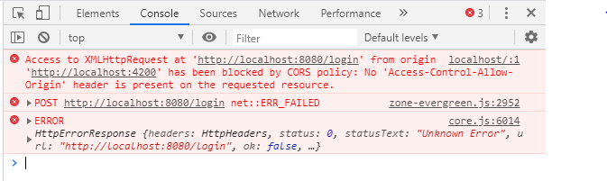

# Seminar 9 - Clientul HTTP: HTML, CSS și JavaScript: structură și request-uri

## Conținut
1. [Clientul HTTP - Front-end](#1-clientul-http---front-end)
    1. [Componente](#11-componente)
    2. [HTML](#12-html)
    3. [CSS](#13-css)

2. [JavaScript în browser](#2-javascript-în-browser)
    1. [DOM-ul](#21-dom-ul)
    2. [Evenimentele DOM-ului](#22-evenimentele-dom-ului)

3. [Structura proiectului](#3-structura-proiectului)

4. [Integrarea Back-endului](#4-integrarea-back-end-ului)
    1. [Listarea filmelor](#41-listarea-filmelor)
    2. [CORS](#42-cors)
    3. [Adăugarea unui film nou](#43-adăugarea-unui-nou-film)

5. [Lucru individual](#5-lucru-individual)


## 1. Clientul HTTP - Front-end
- Am discutat în primele seminare despre modelul client-server și posibilitatea de a executa cod JavaScript atât în interiorul browserului, cât și prin intermediul unui runtime care permite acest lucru (Node.js)

- Ne amintim astfel că orice aplicație web modernă are 2 părți majore - **back-end** (sau server) și **front-end** (sau client)

- Seminarele trecute ne-am concentrat pe implementarea unui back-end care să încapsuleze logica necesară pentru scrierea și citirea datelor de la nivelul unei baze de date

- Însă, API-ul REST dezvoltat nu este *consumat*, momentan, decât cu ajutorul clientului Postman

- Deși Postman este un tool foarte util pentru dezvoltare, nu este o interfață pe care utilizatorii reali ai unei aplicații să îl poată folosi, motiv pentru care, implementând *front-end-ul*, vom dezvolta o interfață simplificată pe care orice persoană să o poată utiliza 

    /)

### 1.1 Componente
- **Front-end-ul reprezintă partea vizibilă și interactivă a unei aplicații web sau a unui website** - este ceea ce utilizatorii văd și elementul principal cu care interacționează

- Front-end-ul include tot ceea ce se întâmplă în browserul unui utilizator - designul paginilor web, layout-ul, stilurile, animațiile și oricare alt element vizibil (sau invizibil) din pagină

- În general, diferențiem **3 elemente** principale ce compun aplicațiile web client, front-end-ul unui sistem:
    - **o componentă structurală** - **HTML** - definește elementele care sunt afișate în pagină
    - **o componentă de stilizare** - **CSS** - conferă un aspect plăcut elementelor structurale
    - **o componentă dinamică** - **JavaScript** - permite utilizatorului să interacționeze cu elementele afișate

    

### 1.2 HTML
- **HTML** (HyperText Markup Language) este un limbaj de marcare utilizat pentru crearea paginilor web ce pot fi afișate într-un browser

- [Recomandare: HTML în o sută de secunde](https://www.youtube.com/watch?v=ok-plXXHlWw)

- O pagină foarte simplă HTML poate fi reprezentată astfel:
    ```HTML
    <!DOCTYPE html>
    <html>
        <head>
            <title>Page Title</title>
        </head>
        <body>
            <h1>My First Heading</h1>
            <p>My first paragraph.</p>
        </body>
    </html>
    ```

- Deoarece bazele HTML au fost deja discutate în cadrul cursului de Multimedia, nu vom intra în foarte multe detalii, însă poți găsi [aici](https://htmlcheatsheet.com/) un cheatsheet și [aici](https://www.w3schools.com/html/default.asp) un tutorial

### 1.3 CSS
- **CSS** (Cascading Style Sheets) este un limbaj de stilizare, un standard web pentru formatarea elementelor unui document HTML

- [Recomandare: CSS în o sută de secunde](https://www.youtube.com/watch?v=OEV8gMkCHXQ)

- CSS va fi studiat în cadrul seminarului următor, însă, pe scurt, putem identifica următoarele caracteristici:
    - **selectori**
        - CSS utilizează selectori pentru a identifica elementele HTML la care se aplică stilurile

        - acestea pot fi elemente specifice, clase, ID-uri sau alte criterii de selecție

        ```css
        /* element */
        body {
            font-family: 'Arial', sans-serif;
        }
        /* clasa */
        .titlu {
            color: #3366cc;
        }
        /* ID */
        #header {
            background-color: #f2f2f2;
        }
        ```

    - **proprietăți**
        - CSS prezintă un set extins de proprietăți pentru a controla aspectul elementelor  

        - printre acestea se numără proprietăți pentru font, culoare, dimensiuni, margini, spațiere, etc

        ```css
        p {
            font-size: 16px;
            color: #333333;
            margin-bottom: 10px;
        }

        .container {
            width: 80%;
            margin: 0 auto;
        }
        ```
    
    - **Specificitatea stilurilor**
        - CSS utilizează un sistem de cascadare (cascading) pentru a determina ordinea de aplicare a stilurilor

        - acesta urmărește o anumită ierarhie și oferă dezvoltatorilor control asupra priorității stilurilor în funcție de specificitatea și ordinea în care sunt definite

        ```css
        /* accesare din ce în ce mai specifică, pornind de la un tip de element, la o clasă și apoi la un identificator */
        h1 {
            color: blue; /* Stil implicit pentru toate elementele h1 */
        }

        .titlu {
            color: red; /* Stil specific pentru clasele cu clasa "titlu" */
        }

        #header h1 {
            color: green; /* Stil specific pentru h1 din interiorul elementului cu ID-ul "header" */
        }
        ```

- Poți găsi o serie extinsă de proprietăți și selectori în [cheatsheet-ul pentru CSS](https://htmlcheatsheet.com/css/)


## 2. JavaScript în browser
- Cea de-a treia componentă, **JavaScript**, un limbaj de programare tradițional, este utilizată pentru a asigura componenta dinamică a paginilor web

- În acest sens, există două subiecte importante de discutat, respectiv:
    - modalitățile prin care JavaScript poate *interacționa în mod direct cu elementele din pagină*

    - felul în care JavaScript este *notificat* în momentul în care un utilizator interacționează cu elementele afișate în pagină

### 2.1 DOM-ul
- Un concept care stă la baza construirii unei pagini web este acela de **DOM** (Document Object Model)

    

- DOM este o reprezentare arborescentă a obiectelor care compun structura și conținutul unei pagini web

- Prin intermediul acestei structuri bazate pe noduri JavaScript poate să acceseze, să modifice și să actualizeze conținutul, structura și stilul documentului HTML în mod dinamic

- Principalele caracteristici ale DOM-ului sunt
    - **Structura arborelui**
        - DOM organizează documentul HTML într-un arbore ierarhic, în care fiecare element este reprezentat printr-un nod
        - nodurile pot fi elemente, atribute, texte sau chiar comentarii

    - **Acces și manipulare**
        - dezvoltatorii web pot utiliza limbaje de programare, cum ar fi JavaScript, pentru a accesa și manipula elementele din DOM
        - astfel, pot schimba conținutul paginii, adăuga sau elimina elemente, modifica stilurile și răspunde la evenimente

    - **Interacțiunea cu utilizatorul**
        - DOM este esențial pentru a crea interactivitate într-o pagină web
        - dezvoltatorii pot răspunde la evenimente și pot actualiza dinamic conținutul paginii fără a solicita o reîncărcare completă a acesteia

- Exemplu de modificare a conținutului unui nod folosind JavaScript și keyword-ul *document*
    ```js
    // accesarea unui element din DOM
    const element = document.getElementById("heading");

    // modificarea conținutului elementului
    element.innerHTML = "My new heading";
    ```

- [Documentație a tuturor metodelor și proprietăților DOM-ului ce sunt accesibile în JavaScript](https://developer.mozilla.org/en-US/docs/Web/API/Document)

### 2.2 Evenimentele DOM-ului
- Pe lânga acces, DOM permite JavaScript să reacționeze la evenimentele ce pot apărea ca urmare a interacțiunii dintre utilizator și elementele vizibile în pagină

    

- Printre mai comune evenimente se numără
    - **Click**
        ```js
        document.getElementById("myButton").addEventListener("click", function() {
            // codul care se va executa la click pe buton
        });
        ```

    - **Mouseover (trecere cu mouse-ul peste un element)**
        ```js
        document.getElementById("myElement").addEventListener("mouseover", function() {
            // codul care se va executa la trecerea cu mouse-ul peste element
        });
        ```

    - **Submit (trimiterea unui formular)**
        ```js
        document.getElementById("myForm").addEventListener("submit", function(event) {
            // codul care se va executa la trimiterea formularului
            event.preventDefault(); // previne comportamentul implicit al formularului
        });
        ```

    - **Change (schimbare la nivelul unui input)**
        ```js
        document.getElementById("myInput").addEventListener("change", function() {
            // codul care se va executa la schimbarea valorii în input
        });
        ```

    - **Load (încărcare pagină)**
        ```js
        window.addEventListener("load", function() {
            // codul care se va executa la încărcarea completă a paginii
        });
        ```


## 3. Structura proiectului
- În general, pentru a permite o bună izolare a fiecărei componente, vom defini fiecare element într-un fișier separat

- Astfel, în primă instanță, structura va fi foarte simplă:
    - **index.html** -> conține elementele structurale
    - **style.css** -> conține stilurile aplicate pe elemente
    - **script.js** -> conține interacțiunile cu elementele definite

- Similar, pentru a organiza separat back-end-ul de front-end, vom modifica directorul *app*, mutând tot conținutul curent într-un subdirector nou denumit *be*

- Ulterior, vom crea un nou director numit *fe* în care vom defini cele 3 fișiere menționate anterior

- În fișierul *index.html* vom adăuga elementele necesare pentru testarea structurii
```html
<html>
    <head>
        <title>action!</title>
        <link rel="stylesheet" href="style.css"/>
    </head>
    <body>
        <h1>Hello action!</h1>
    </body>
    <script src="script.js"></script>
</html>
```

- Deși fișierele HTML pot fi deschise direct în browser, pentru executarea request-urilor pe care o vom implementa în pasul următor avem nevoie ca toate fișierele front-end-ului să fie servite de un server web

- Cele mai populare servere web sunt nginx, Apache HTTP Server și Microsoft IIS

- Însă, pentru că aplicația noastră este în faza de dezvoltare, vom folosi un utilitar pentru a evita instalarea și configurarea unei soluții robuste

- Vom instala global pachetul *serve* utilizând comanda
    ```sh
    npm install -g serve
    ```

- Vom naviga în directorul *fe* folosind un terminal, vom executa comanda *serve* și vom accesa serverul pornit la adresa indicată în terminal


## 4. Integrarea back-end-ului
- Primul pas al integrării este reprezentat de pornirea aplicației back-end, ce va începe să asculte request-uri pe un anumit port (în mod default 8080)

### 4.1 Listarea filmelor
- Pentru a lista toate filmele existente la nivelul bazei de date, va trebui să apelăm endpoint-ul de listare și să afișăm conținutul returnat de acesta

- Putem ajunge la o variantă de implementare modificând conținutul fișierelor astfel
    - index.html
        ```html
        <html>
            <head>
                <title>action!</title>
                <link rel="stylesheet" href="style.css"/>
            </head>
            <body>
                <div class="container">
                    <h1>This will be an awesome app!</h1>
                    <!-- atașarea unui event handler pentru evenimentul de click asupra butonului -->
                    <button onclick="loadMovies()">Load movies</button>
                    <h3>The movies available in the app are: </h3>
                    <!-- definirea unui ID ce poate fi utilizat pentru identificarea elementului la nivelul JavaScript -->
                    <div id="moviesContainer">
                        <p>Nothing loaded yet - click on the button to load the movies</p>
                    </div>
                </div>
            </body>
            <script src="script.js"></script>
        </html>
        ```

    - style.css
        ```css
        .container {
            margin: 0 auto;
            width: 80%;
            text-align: center;
        }

        .movie-container {
            border: 1px solid black;
            padding: 10px;
            width: 20%;
            margin: 10px auto;
            cursor: pointer;
        }

        .movie-container:hover {
            background-color: whitesmoke;
        }

        .poster-container {
            max-height: 100px;
        }
        ```

    - script.js
        ```js
        function loadMovies() {
            // apelarea endpoint-ului de listare a filmelor
            fetch("http://localhost:8080/api/v1/movies")
                .then(response => response.json())
                .then(data => data.movies)
                .then(movies => {
                    // selectarea unui element din pagină pe baza ID-ului
                    const moviesList = document.getElementById("moviesContainer");
                    // ștergerea conținutului 
                    moviesList.innerHTML = "";

                    // pentru fiecare film returnat, o serie nouă de elemente HTML sunt generate, populate cu date și, la final, adăugate în pagină prin intermediul elementului moviesList
                    for(let movie of movies) {
                        // crearea unui nou element HTML
                        const item = document.createElement("div");
                        // adăugarea unei clase CSS pe un element
                        item.classList.add("movie-container");
                        // atașarea unui event handler ce va fi apelat atunci când elementul va înregistra un eveniment de tipul click
                        item.addEventListener("click", () => onMovieClick(movie));

                        const movieName = document.createElement("p");
                        // actualizarea textului afișat în interiorul componentei
                        movieName.innerText = movie.title + " (" + movie.year + ")";

                        const moviePoster = document.createElement("img");
                        // setarea unui atribut
                        moviePoster.setAttribute("src", movie.poster);
                        moviePoster.classList.add("poster-container");

                        // atașarea elementelor nou create la elementul părinte nou creat
                        item.appendChild(movieName);
                        item.appendChild(moviePoster);

                        // atașarea elementului părinte nou creat la elementul existent în pagină
                        moviesList.appendChild(item);
                    }
                });
        }

        function onMovieClick(movie) {
            // afișarea unui mesaj sub formă de alertă
            alert("Directed by " + movie.director);
        }
        ```

### 4.2 CORS
- După implementarea codului și reîncărcarea paginii accesate, vom observa în consola browserului o eroare similară

    

- Aceasta se datorează mecanismului de Cross-Origin Resource Sharing (CORS) ce nu permite unui browser să apeleze un API decât dacă acel API menționează explicit că adresa de la care browserul face request-ul este o adresă validă

- Acest mecanism are ca scop standardizarea și securizarea accesului între domenii și trebuie configurat cu multă atenție!
    - [Recomandare: configurarea corectă a CORS](https://www.section.io/engineering-education/how-to-use-cors-in-nodejs-with-express/)

- Pe parcursul dezvoltării, însă, putem folosi un utilitar la nivelul back-end-ului pentru a permite apelul acestuia de la nivelul oricărui domeniu:
    - Instalarea pachetului *cors*
        ```sh
        npm install --save cors
        ```

    - Modificarea fișierului principal pentru a include noul pachet
        ```js
        import cors from "cors";

        //.. implementare
            
        const app = express();

        // process incoming JSON bodies in requests
        app.use(express.json());
        app.use(cors());

        //.. implementare
        ```

    - Repornirea serverului

- Retestarea request-ului din front-end funcționează după configurarea CORS la nivelul back-end-ului

### 4.3 Adăugarea unui nou film
- Pentru a implementa procesul de adăugare a unui film în aplicație, vom utiliza o serie de câmpuri în care vom introduce datele necesare (pe scurt, un formular) și o metodă care să gestioneze crearea request-ului utilizând aceste date:
    - index.html
        ```html
        <div>
            <p>Insert the details about the new movie</p>
            <form id="movieForm">
                <label for="title">Title:</label>
                <input type="text" id="title" name="title" required>

                <label for="year">Year:</label>
                <input type="number" id="year" name="year" required>

                <label for="director">Director:</label>
                <input type="text" id="director" name="director" required>

                <label for="genre">Genre:</label>
                <input type="text" id="genre" name="genre" required>

                <label for="synopsis">Synopsis:</label>
                <textarea id="synopsis" name="synopsis" required></textarea>

                <label for="duration">Duration (minutes):</label>
                <input type="number" id="duration" name="duration" required>

                <label for="poster">Poster URL:</label>
                <input type="url" id="poster" name="poster" required>

                <button type="button" onclick="addMovie()">Submit</button>
            </form>
        </div>
        ```

    - style.css
        ```css
        textarea {
            resize: vertical;
        }

        #movieForm {
            width: 30%;
            margin: 0 auto;
            text-align: left;
        }

        #movieForm input,
        #movieForm textarea {
            width: 100%;
            box-sizing: border-box;
            margin-bottom: 10px;
        }

        #movieForm button {
            width: 100%;
        }
        ```

    - script.js
        ```javascript
        function addMovie() {
            // extragerea datelor din campurile formularului
            const formData = {
                title: document.getElementById('title').value,
                year: parseInt(document.getElementById('year').value),
                director: document.getElementById('director').value,
                genre: document.getElementById('genre').value,
                synopsis: document.getElementById('synopsis').value,
                duration: parseInt(document.getElementById('duration').value),
                poster: document.getElementById('poster').value,
            };

            // apelarea endpoint-ului de creare a unui nou film
            fetch('http://localhost:8080/api/v1/movies', {
                method: 'POST',
                headers: {
                    'Content-Type': 'application/json',
                },
                body: JSON.stringify(formData),
            })
            // dupa adaugarea cu succes a unui nou film, lista de filme de la nivelul front-end-ului este reincarcata
                .then(response => loadMovies())
                .catch((error) => {
                    console.error('Error:', error);
                });
        }
        ```

## 5. Lucru individual
- Plecând de la exemplul anterior, încearcă să integrezi în pagină, după secțiunile implementate la seminar, operațiile de listare a tuturor entităților persoană din baza de date și de adăugare a unei persoane noi utilizând endpoint-urile specifice
