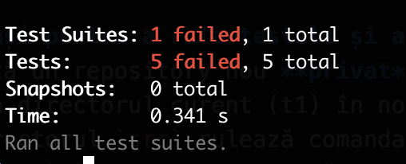
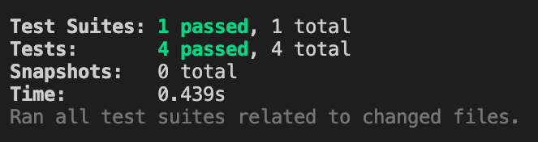

# Tema 4

## React

### Obiectiv: să se modifice aplicația inițială astfel încât să treacă [testele](./main/src/tests/)

### 1. Completați următoarele cerințe:
- Dată fiind aplicația, modificați codul sursă astfel încât:
    - Aplicația pornește și funcționează fără eroare; (0.5 pts)
    
    - Se definește o componentă RobotForm; (0.5 pts)
    
    - RobotForm adaugă un robot cu proprietăți vide dacă se dă direct click pe butonul de `add`; (0.5 pts)
    
    - Dat fiind că input-urile pentru proprietățile robotului au id-urile `name`, `type` and `mass` și că butonul de adăugare are valoarea `add` se poate adăuga un robot;(0.5 pts)
    
    - Dacă se adaugă un robot cu `weight` mai mic de 500, elementul adăugat va avea `weight` în starea inițială(un string vid). (0.5 pts)

### 2. Pași pentru a rula testele și a trimite tema:
1. Creează un repository nou, **privat** pe GitHub cu numele *webtech-tema-4*
2. Adaugă directorul curent (t4) în noul repository
3. În directorul `main` rulează comanda `npm install` pentru a instala modulele necesare executării testelor
4. Adaugă implementarea necesară rezolvării cerințelor în fișierul app.js din directorul main
5. În directorul `main` rulează comanda `npm test` pentru a rula testele
6. Verifică rezultatul testelor
    - Teste picate
        

    - Teste valide
        
7. După rezolvarea cerințelor creează un commit și folosește comanda push pentru a încărca modificările pe GitHub (detalii în [primul seminar](./../s1/README.md))
8. Acordă acces profesorului de la seminar pentru verificarea repository-ului
    - [Tutorial acordare acces](https://docs.github.com/en/account-and-profile/setting-up-and-managing-your-personal-account-on-github/managing-access-to-your-personal-repositories/inviting-collaborators-to-a-personal-repository)
    - User profesor: [axbg](https://github.com/axbg)
9. Copiază link-ul repository-ului și completează [acest formular](https://forms.gle/BbnHx7qtGK61YduP7)